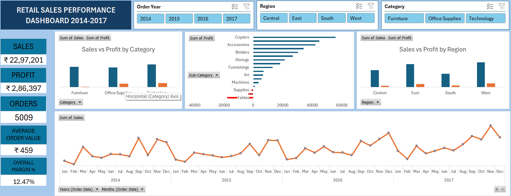

# Retail Sales Analytics Dashboard

## Overview
End-to-end analysis of retail sales performance (2014–2017) using Python for data cleaning and exploratory analysis, and Excel for interactive dashboard reporting. The project covers the full analyst workflow: raw data → cleaning → analysis → business insights → interactive reporting.

## Dataset
Superstore Sales dataset (Kaggle) — ~9,800 orders across US regions, covering Sales, Profit, Discount, Category, Sub-Category, Region, and Customer Segment.

## Tools Used
- **Python**: pandas, matplotlib, seaborn (data cleaning, feature engineering, exploratory data analysis)
- **Excel**: Power Query, PivotTables, PivotCharts, Slicers (interactive dashboard)

## Key Findings

1. **Furniture underperforms despite strong sales.** The category generates $742K in sales — nearly as much as Office Supplies — but only $18K in profit, compared to Office Supplies' $122K. Tables and Bookcases are the main drag, both operating at a net loss.

2. **Discounting correlates with unprofitability.** Tables and Bookcases carry among the highest average discounts (21–26%) of any sub-category, and are the only major sub-categories with consistently negative average profit — suggesting current discount policy exceeds their margin tolerance.

3. **Texas is the single worst-performing state** (-$25.7K profit) despite $170K in sales, driven primarily by losses in the Binders sub-category — a distinct issue from the national Furniture/discount trend, showing that regional problems don't always mirror category-level ones.

4. **Central region underperforms relative to its sales volume**, largely explained by concentrated losses in Texas, Ohio, Pennsylvania, and Illinois.

5. **Consumer segment drives the most profit** ($134K), ahead of Corporate ($92K) and Home Office ($60K).

6. **Clear, consistent seasonality**: sales peak every November/December across all four years, with steady year-over-year growth in peak values.

## Dashboard Preview


The dashboard includes:
- KPI summary (Total Sales, Profit, Orders, Average Order Value, Overall Margin %)
- Sales vs Profit by Category and by Region
- Profit by Sub-Category (highlighting loss-making items)
- Monthly sales trend (2014–2017)
- Interactive slicers for Year, Region, and Category

## Project Structure
```
retail-sales-analysis/
├── data/
│   ├── raw/                    # Original Superstore dataset
│   └── processed/              # Cleaned dataset exported from Python
├── notebooks/
│   └── analysis.ipynb          # Data cleaning, feature engineering, EDA
├── reports/
│   ├── retail_dashboard.xlsx   # Interactive Excel dashboard
│   └── dashboard_screenshot.png
├── requirements.txt
└── README.md
```

## How to Reproduce
1. Clone this repository
2. Install dependencies:
   ```
   pip install -r requirements.txt
   ```
3. Run `notebooks/analysis.ipynb` to reproduce the data cleaning and analysis
4. Open `reports/retail_dashboard.xlsx` to explore the interactive dashboard

## Author
Niyu — MSc Data Science student, aspiring Data Analyst
